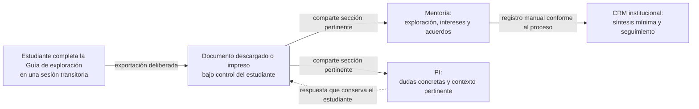

# Arquitectura de la Guía de exploración como documento compartible

> **Nota de evolución:** La auditoría posterior del journey propone permitir un
> borrador local opcional en dispositivos personales, sin persistir nombre ni
> matrícula. La recomendación y sus controles se documentan en
> `JOURNEY_NAMING_AUDIT.md`; deberá convertirse en una nueva decisión antes de
> implementar la variante.

## Decisión de producto

La Guía de exploración no será una cuenta, expediente o formulario enviado a una base de
datos. Será un **documento de enlace** que el estudiante construye durante la
microintervención y puede llevar a las conversaciones posteriores.

Su función es conservar continuidad sin confundir responsabilidades:

- mentoría ayuda a comprender propósito, intereses, criterios y tensiones;
- Programas Internacionales responde o valida preguntas operativas concretas;
- el estudiante decide qué comparte y ejecuta los siguientes pasos;
- la persona mentora documenta en el CRM institucional únicamente la síntesis y
  los acuerdos necesarios para dar continuidad.

## Flujo de información

No existe una flecha del sitio al CRM, a PI ni a mentoría: no hay envío
automático.

## Estructura del documento

### A. Carátula común

- nombre del estudiante;
- matrícula;
- fecha de la conversación;
- etapa declarada del proceso;
- propósito de la Guía de exploración y nota de control de quien participa.

No se solicitan teléfono, correo, pasaporte, datos financieros, salud ni
documentos probatorios.

### B. Síntesis para mentoría

Debe permitir documentar la conversación de exploración:

- qué decisión o duda trajo al estudiante;
- qué quiere aprender, practicar o experimentar;
- qué oportunidad no encuentra actualmente en su trayectoria;
- intereses académicos, profesionales o personales pertinentes;
- criterios prioritarios y tensión principal;
- apoyo solicitado a mentoría;
- hallazgo o reformulación producida durante la sesión.

### C. Preguntas para Programas Internacionales

Debe contener contexto suficiente sin convertir a PI en destinatario de toda la
reflexión:

- pregunta concreta;
- opción, etapa o proceso al que se refiere, cuando aplique;
- fuente oficial ya consultada;
- qué se encontró y qué sigue sin estar claro;
- canal sugerido y fecha de consulta.

No debe copiar tablas de requisitos, costos, fechas u oferta. El documento enlaza
a la fuente oficial.

### D. Acuerdos y seguimiento

- siguiente acción del estudiante;
- canal o persona de apoyo;
- fecha acordada;
- evidencia esperada de avance;
- fecha o condición para un contacto posterior;
- estado editable en el documento: pendiente, realizado o requiere apoyo.

El seguimiento no es vigilancia automática. Es un acuerdo visible que puede
retomarse en una sesión posterior.

### E. Resumen mínimo para CRM

La salida debe ofrecer a mentoría una caja separada y fácil de copiar, no un envío
automático. Contendrá sólo:

- fecha y tipo de sesión;
- motivo breve de consulta;
- intereses o criterio central pertinente;
- orientación o conexión realizada;
- acuerdo de siguiente paso;
- fecha o condición de seguimiento.

No incluirá narrativas íntimas, montos, calificaciones, nivel de idioma ni copias
de documentos. Si el CRM ya contiene nombre y matrícula, éstos sirven para ubicar
el registro, pero no necesitan repetirse en la nota narrativa.

## Vistas de exportación

Para proteger la pertinencia de la información, la variante debe ofrecer tres
salidas seleccionables:

1. **Resumen de exploración:** copia de quien participa con todas las secciones.
2. **Hoja para PI:** identificación, contexto mínimo, preguntas y acciones
   relacionadas con PI.
3. **Resumen de mentoría:** exploración, acuerdos y caja de texto para CRM.

La selección de una vista no borra contenido durante la sesión; sólo limita lo
que aparece en la impresión o archivo generado.

## Ciclo de vida de los datos en el sitio

| Momento | Comportamiento |
|---|---|
| Entrada | El sitio explica que no almacena ni envía información. |
| Captura | Los valores permanecen en la memoria de la pestaña. |
| Uso | La mentora y el estudiante trabajan sobre el dispositivo elegido. |
| Exportación | El estudiante selecciona la vista y guarda o imprime el documento. |
| Cierre/recarga | Los valores desaparecen; no existe recuperación desde el sitio. |
| Seguimiento | Se retoma el archivo del estudiante o la nota institucional del CRM. |

## Requisitos de aceptación para la futura implementación

- retirar todo uso de `localStorage` y cualquier persistencia equivalente;
- no agregar backend, cuentas, cookies de identificación ni parámetros con datos
  personales en la URL;
- no enviar contenido de campos a servicios de analítica o IA;
- mostrar el aviso de pérdida de información antes de iniciar y al intentar
  recargar o cerrar con trabajo no exportado;
- permitir borrar todos los campos con una acción visible;
- generar las tres vistas de impresión sin depender de un servidor;
- excluir por defecto del documento para PI las notas exclusivas de mentoría;
- utilizar etiquetas claras para indicar quién responde cada pregunta;
- incluir una nota que distinga información reflexiva de validación oficial;
- comprobar accesibilidad por teclado, lectura de pantalla y formato impreso.

## Preguntas de gobernanza que permanecen abiertas

La arquitectura técnica está definida, pero antes del piloto deben acordarse:

- redacción final del aviso al estudiante;
- campos mínimos permitidos en la nota de CRM;
- quién realiza y cierra el contacto posterior;
- si el estudiante entrega la hoja para PI o mentoría lo apoya a canalizarla;
- plazo y medio institucional aplicable a los archivos que una persona decida
  compartir con cada área.
